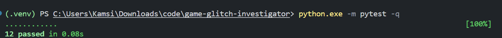
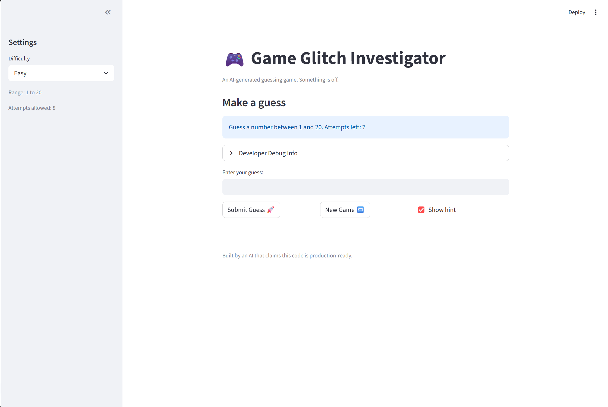

# 🎮 Game Glitch Investigator: The Impossible Guesser

## 🚨 The Situation

You asked an AI to build a simple "Number Guessing Game" using Streamlit.
It wrote the code, ran away, and now the game is unplayable. 

- You can't win.
- The hints lie to you.
- The secret number seems to have commitment issues.

## 🛠️ Setup

1. Install dependencies: `pip install -r requirements.txt`
2. Run the broken app: `python -m streamlit run app.py`

## 🕵️‍♂️ Your Mission

1. **Play the game.** Open the "Developer Debug Info" tab in the app to see the secret number. Try to win.
2. **Find the State Bug.** Why does the secret number change every time you click "Submit"? Ask ChatGPT: *"How do I keep a variable from resetting in Streamlit when I click a button?"*
3. **Fix the Logic.** The hints ("Higher/Lower") are wrong. Fix them.
4. **Refactor & Test.** - Move the logic into `logic_utils.py`.
   - Run `pytest` in your terminal.
   - Keep fixing until all tests pass!

## 📝 Document Your Experience

- [x] Describe the game's purpose.
- [x] Detail which bugs you found.
- [x] Explain what fixes you applied.

### Game Purpose
This app is a Streamlit number guessing game where the player selects a difficulty, tries to guess a hidden number within a limited number of attempts, and gets feedback and score updates after each guess.

### Bugs Found
- The secret number changed randomly in between rounds
- Hint direction logic was wrong
- Normal difficulty range was easier than Easy
- Input handling accepted bad values ("", "letters") in edge cases
- Scoring behavior for non-winning guesses was inconsistent 

### Fixes Applied
- Stored game state consistently using Streamlit session state so the secret number remains stable
- Corrected hint direction logic
- Fixed difficulty ranges
- Improved input validation to reject guesses that weren't numbers.
- Updated score for "Too High" and "Too Low" outcomes and verified score behavior
- Added tests in `tests/test_game_logic.py` and verified all tests pass with `pytest`

## 📸 Demo

- [x] [Insert a screenshot of your fixed, winning game here]

## 🚀 Stretch Features

- [ ] [If you choose to complete Challenge 4, insert a screenshot of your Enhanced Game UI here]
